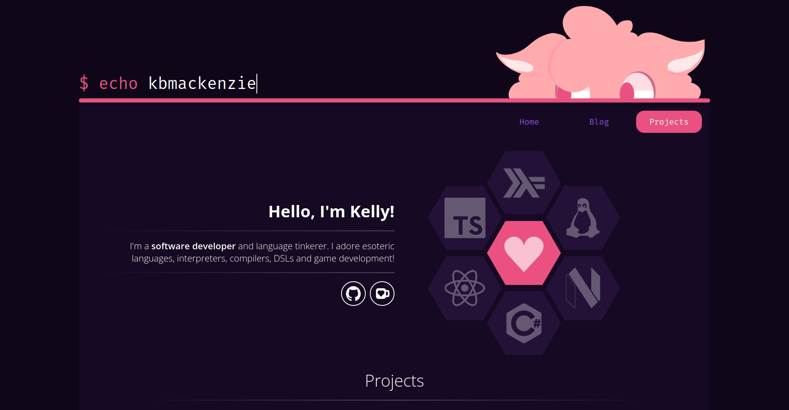

The repository for my personal website/blog. See it in action at [kbmackenzie.xyz][1]!

Written entirely from scratch in TypeScript with React, Sass and Next.js.

All animations are written by hand! No templates used! 🐱💖 Additionally, blog posts are organized with [Alpaca][2], a little blog utility I wrote!

[1]: https://kbmackenzie.xyz
[2]: https://github.com/kbmackenzie/alpaca
